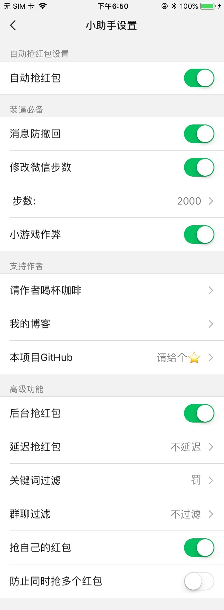

# DKWechatHelper   
 
不止于抢红包，功能丰富的微信插件。本软件已成功运行在(iphone7-iphoneX) 微信7.0.0-7.0.2    
给个⭐️不迷路↗️
## 特色    
1.完全融入微信7.0UI风格，沉浸式体验   
2.完全免费的全功能插件  
3.非越狱可后台抢红包   
4.~安全高效源码公开~ (源码整理中,尽快发布)   
5.设置方便，手机无需越狱   
## 功能    
1.自动抢红包   
2.消息防撤回   
3.微信步数修改   
4.小游戏作弊（剪刀石头布和掷骰子）     
5.自动抢红包高级配置   
安装后在微信设置中点击“微信小助手”  
更多请查看下图：   

## 使用：  
1.源码学习   
    ~下载本项目，下载砸壳后的微信（7.0以上）[我给你准备了个](https://pan.baidu.com/s/1SHZHfu94Z_jhCkaaFDx8pA),将下载的微信放到'/dkhelper/dkhelper/TargetApp/'目录下该目录下有一个空白文件’put ipa or app here‘，和它放在同一文件夹下即可，修改项目BundleId及签名信息，选择真机设备运行即可~源码整理中尽快提供完整代码

2.开发者：   
    下载以下ipa后重签名应用：[未签名版](https://pan.baidu.com/s/1-zEUQRGn3H4bZVqHpyffzQ)   
    注：推荐使用[ios-app-signer](https://github.com/DanTheMan827/ios-app-signer)签名，使用方法自行百度     
3.普通用户：   
    前往以下地址下载：[未签名](https://pan.baidu.com/s/1-zEUQRGn3H4bZVqHpyffzQ)
    下载后使用 [Cydia Impactor](http://www.cydiaimpactor.com/)安装   

### 请我喝杯☕️     

|  微信  | 支付宝 |
| --- | --- |
|  |  |

### 感谢：   
本插件所有内容均为免费内容，其中使用了部分已存在项目源码构建。感谢以下项目的开源：  
1.[WeChatPlugin-iOS](https://github.com/TKkk-iOSer/WeChatPlugin-iOS)   
2.[WeChatRedEnvelop](https://github.com/buginux/WeChatRedEnvelop)   
3.[MonkeyDev](https://github.com/AloneMonkey/MonkeyDev)   
4.[微信共存防封版伪代码分析](https://www.jianshu.com/p/e797ba55e336)   

