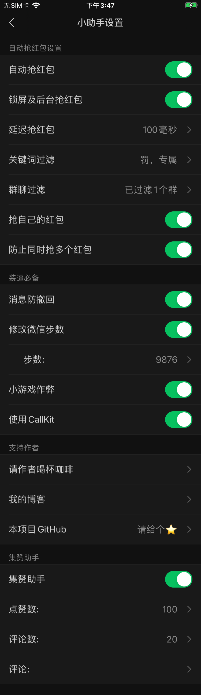

# DKWechatHelper   
 

 
不止于抢红包，功能丰富的微信插件。本软件已成功运行在(iphone7-iphone14、iPad) 
给个⭐️不迷路↗️   

|[v1.1.0](https://github.com/DKWechatHelper/DKWechatHelper/releases/tag/1.1.0)适用微信8.0.38   |[v1.0.9](https://github.com/DKWechatHelper/DKWechatHelper/releases/tag/1.0.9)适用微信8.0.13   ||
| --- | --- | --- |
| [v1.0.8](https://github.com/DKWechatHelper/DKWechatHelper/releases/tag/1.0.8)适用微信8.0.6   |[v1.0.7](https://github.com/DKWechatHelper/DKWechatHelper/releases/tag/1.0.7)适用微信8.0.1    | [v1.0.6](https://github.com/DKWechatHelper/DKWechatHelper/releases/tag/1.0.6)适用微信7.0.17   |
| [v1.0.5](https://github.com/DKWechatHelper/DKWechatHelper/releases/tag/1.0.5)适用微信7.0.15 | [v1.0.4](https://github.com/DKWechatHelper/DKWechatHelper/releases/tag/1.0.4)适用微信7.0.14   | [v1.0.3](https://github.com/DKWechatHelper/DKWechatHelper/releases/tag/1.0.3)适用微信7.0.13  |
|[v1.0.2](https://github.com/DKWechatHelper/DKWechatHelper/releases/tag/1.0.2)适用微信7.0.11  |[v1.0.1](https://github.com/DKWechatHelper/DKWechatHelper/releases/tag/1.0.1)适用微信7.0.8~7.0.10 |[v1.0.0](https://github.com/DKWechatHelper/DKWechatHelper/releases/tag/1.0.0) 适用微信7.0.0-7.0.3  |

更多更新内容请查看[CHANGELOG](./CHANGELOG.md)   
图片加载失败可以到[掘金](https://juejin.cn/post/7009142365671817223)查看，本文将在[掘金](https://juejin.cn/post/7009142365671817223)同步更新。
## 特色    
1.完全融入微信8.0UI风格，沉浸式体验   
2.完全免费的全功能插件  
3.非越狱可后台抢红包   
4.安全高效源码公开   
5.设置方便，手机无需越狱   
## 功能   

* [x] 自动抢红包  
* [x] 后台抢红包 
* [x] 群聊过滤
* [x] 关键词过滤
* [x] 消息防撤回     
* [x] 微信步数修改   
* [x] 小游戏作弊（剪刀石头布和掷骰子）     
* [x] CallKit锁屏接视频语音
* [x] 集赞助手   
* [x] 好友关系检测(已更新)  
* [x] 朋友圈转发  
* [x] 动态聊天背景  
* [x] 动态启动图  

安装后在微信设置中点击“微信小助手”  
更多请查看下图：  

## 使用：  
⚠️⚠️⚠️下载默认密码：`dkjone`    
1.源码学习   
    下载本项目，下载砸壳后的微信（7.0以上）（我给你准备了个) 
    
|[8.0.38](https://url15.ctfile.com/f/24576815-874026915-d7c546?p=1756)|[8.0.13](https://url15.ctfile.com/f/24576815-513705776-0adb11)   |[8.0.6](https://n802.com/f/24576815-496573913-9ce385)|
|---| --- | --- |
|[8.0.1](https://n802.com/f/24576815-480279421-6c84b9)|[7.0.17](https://n802.com/file/24576815-467161527)|[7.0.15](https://n802.com/file/24576815-463029595)  |
|[7.0.14](https://n802.com/file/24576815-452231690) |[7.0.13-*提取码: nx4m*](https://pan.baidu.com/s/1rqB0pV4zMEB6Z3VJTsTa8Q)|[7.0.11-*提取码: 2igg*](https://pan.baidu.com/s/1mU_mezsWhqL2-AY0PB-vVg)  |
| [7.0.8-*提取码:h54d*](https://pan.baidu.com/s/11VoUXPC4vb5zg8HzP3kC0Q)   | [7.0.2](https://pan.baidu.com/s/1SHZHfu94Z_jhCkaaFDx8pA)   |  [7.0.0](https://pan.baidu.com/s/15pVma66Ea822YVGrBa2GHw)   |   

将下载的微信放到'/dkhelper/dkhelper/TargetApp/'目录下该目录下有一个空白文件’put ipa or app here‘，和它放在同一文件夹下即可，修改项目BundleId及签名信息，选择真机设备运行即可   

2.开发者：   
    下载以下ipa后重签名应用：
    
| [未签名版8.0.38](https://url15.ctfile.com/f/24576815-874026981-5029c9?p=1756)|||
| --- | --- | --- |
| [未签名版8.0.13](https://url15.ctfile.com/f/24576815-513705667-6aa955) |[未签名版8.0.6](https://n802.com/f/24576815-496574216-b01bf7)  | [未签名版8.0.1](https://n802.com/f/24576815-480300249-d79448)  |
|[未签名版7.0.17](https://n802.com/file/24576815-467161662)   |[未签名版7.0.15](https://n802.com/file/24576815-463034104)|[未签名版7.0.14](https://n802.com/file/24576815-452232682) |
| [未签名版7.0.13-*提取码: fhes*](https://pan.baidu.com/s/1DgSl5u0Gip3cNdqZmRFEWw) | [未签名版7.0.11-*提取码: fe9f*](https://pan.baidu.com/s/1sOPCqnCPxSdIKq7TKuHK9g) | [未签名版7.0.0](https://pan.baidu.com/s/1-zEUQRGn3H4bZVqHpyffzQ)   | 
   
   注：推荐使用[ios-app-signer](https://github.com/DanTheMan827/ios-app-signer)签名，使用方法自行百度  

3.普通用户：   
    前往以下地址下载：上方未签名版
    下载后使用 [Cydia Impactor](http://www.cydiaimpactor.com/)或者`爱思助手`或者[AltStore](https://github.com/rileytestut/AltStore)安装  
    
4.越狱用户：  
添加源`https://dkjone.github.io/`下载或直接下载deb文件:      
| [1.1.0deb](https://url15.ctfile.com/f/24576815-874029648-9fec88?p=1756 )  | [1.0.9deb](https://url15.ctfile.com/f/24576815-513707605-d0d6fb)  | [1.0.8deb](https://n802.com/f/24576815-496575548-fa5b89) |  [其他deb下载地址](https://gitee.com/DKJone/dkjone.github.io/tree/master/debs) |
| --- | --- | --- |--- |

### 请我喝杯☕️     

|  微信  | 支付宝 |
| --- | --- |
|  |  |

### 感谢：   
本插件所有内容均为免费内容，其中使用了部分已存在项目源码构建。感谢以下项目的开源：  
1.[WeChatPlugin-iOS](https://github.com/TKkk-iOSer/WeChatPlugin-iOS)   
2.[WeChatRedEnvelop](https://github.com/buginux/WeChatRedEnvelop)   
3.[MonkeyDev](https://github.com/AloneMonkey/MonkeyDev)   
4.[微信共存防封版伪代码分析](https://www.jianshu.com/p/e797ba55e336)   

